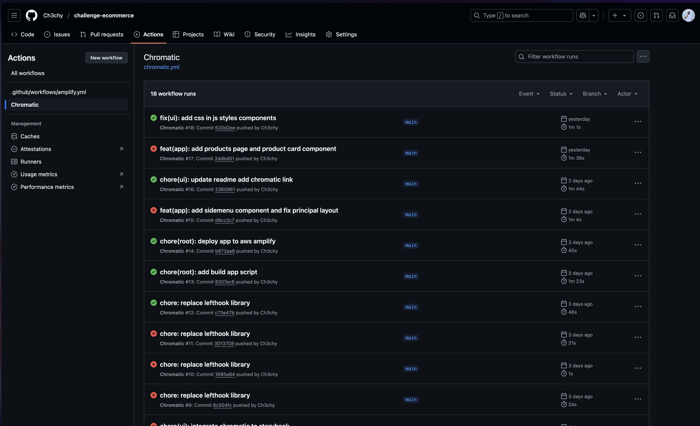

# Checho Challenge UI

## 📦 Descripción

Este paquete contiene la librería de componentes reutilizables para el proyecto **challenge-ecommerce**. Está diseñada para ser utilizada en múltiples aplicaciones, proporcionando una base consistente de componentes UI.

## 🛠️ Construcción

Para compilar la librería y generar los archivos necesarios para su distribución, ejecuta el siguiente comando:

```sh
npm run build
```

Esto generará los archivos en la carpeta `dist`, incluyendo los formatos `ES` y `UMD`, así como los archivos de tipos TypeScript.

## 🎨 Base de Estilos

La librería también incluye la base de estilos, como colores y fuentes, que se pueden personalizar según las necesidades del proyecto.

### 📌 Personalización de Colores

Para cambiar los valores de los colores, edita el archivo:

- `src/styles/variables/_colors.scss`

En este archivo, encontrarás un mapa de colores (`$colors`) que define los colores base y sus variantes. Por ejemplo:

```scss
$colors: (
  black: hsl(235, 21%, 11%),
  white: hsl(0, 0%, 98%),
  gray: (
    100: hsl(235, 21%, 11%),
    200: hsl(235, 24%, 19%),
    ...
  ),
  red: (
    500: hsl(347, 99%, 57%),
  ),
);
```

Modifica los valores según tus necesidades y los cambios se reflejarán automáticamente en los estilos de la aplicación.

### 📌 Uso de Mixins

Para integrar los mixins en tus estilos, utiliza la siguiente instrucción:

```scss
@use "checho-challenge-ui/styles/mixins";
```

Luego, puedes aplicar los mixins donde los necesites. Por ejemplo, para aplicar estilos responsivos:

```scss
@include mixins.responsive(md) {
  align-items: center;
}
```

Esto permite aplicar estilos específicos basados en los puntos de quiebre definidos en la librería.

## 📖 Documentación de Componentes con Storybook

La librería está integrada con **Storybook**, una herramienta que permite visualizar y documentar cada componente de manera interactiva. 

### 📌 Cómo ejecutar Storybook

Para iniciar Storybook en tu entorno local, ejecuta el siguiente comando:

```sh
npm run storybook
```

Esto abrirá una interfaz en tu navegador donde podrás explorar todos los componentes disponibles, junto con sus propiedades (`props`), ejemplos de uso y variaciones.

### 📌 Documentación de Componentes

Cada componente está documentado en Storybook con ejemplos prácticos y configuraciones personalizables. Esto facilita la comprensión y reutilización de los componentes en diferentes proyectos.

### 🌐 Storybook Desplegado

Puedes acceder al Storybook desplegado en el siguiente enlace: [Storybook - Checho Challenge UI](https://67f0e6620850b0c0086cf36f-ftkqokulbi.chromatic.com/)

Y al Chronomatic en el siguiente link: [Chronomatic](https://www.chromatic.com/library?appId=67f0e6620850b0c0086cf36f&branch=main)

### 📌 Vista del pipeline de Chronomatic

A continuación, se muestra una imagen del flujo de publicacion en Chronomatic:



## 🚀 Publicación en npm

Para publicar la librería en npm, asegúrate de haber iniciado sesión en tu cuenta de npm:

```sh
npm login
```

Luego, ejecuta el siguiente comando para publicar la librería:

```sh
npm publish --access public
```

> **Nota:** Asegúrate de que el número de versión en el archivo `package.json` haya sido incrementado antes de publicar, siguiendo las reglas de versionado semántico (semver).
